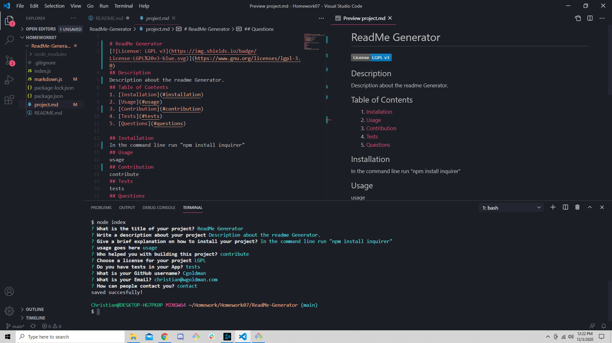

# ReadMe-Generator
  
## My story
* Project enabled me to better understand string interpolation
* I no longer have to manually build my ReadMe I can utilize the generator
## Features ##
* Users are able to list the description in the ReadMe in one big paragraph or seperate key points using bullet points
* A badge displaying various license will appear at the top of the page
* A table of contents that will take you to the corresponding location on the readme
* A corresponding notice to the license you have chosen will appear at the bottom of the ReadMe
## Installation ##
1. Open up git bash terminal
2. Change directory to desired location (%User Profile%/SourceRepo)
3. Clone the repository (git clone git@github.com:ChristianGoldman/ReadMe-Generator.git)
## Usage ##
1. Open up git bash terminal
2. Change directory to the cloned repo
3. Navigate to the ReadMe-Generator folder
4. In the command line run "npm install"
5. In the commmand line run "node index.js"
6. In the command line fill out all relevant questions
7. Once you have filled out all the questions you should see a Generated ReadMe file with all the corresponding information. It should look something like this.

## Credits ##
* Cwerness gitlab
* https://www.w3schools.com/js/default.asp
* Tutor Makism
* BCA learning assistants
* TA's Paul Hendrickson, Tommy Boone, Jake O'Thoole, Daniel Thao
## Link to ReadMe Generator walkthrough video ##
* https://www.youtube.com/watch?v=IGjJCeZSPE4
## License ##
    MIT License

    Copyright (c) [2020] [Christian Goldman]

    Permission is hereby granted, free of charge, to any person obtaining a copy
    of this software and associated documentation files (the "Software"), to deal
    in the Software without restriction, including without limitation the rights
    to use, copy, modify, merge, publish, distribute, sublicense, and/or sell
    copies of the Software, and to permit persons to whom the Software is
    furnished to do so, subject to the following conditions:

    The above copyright notice and this permission notice shall be included in all
    copies or substantial portions of the Software.

    THE SOFTWARE IS PROVIDED "AS IS", WITHOUT WARRANTY OF ANY KIND, EXPRESS OR
    IMPLIED, INCLUDING BUT NOT LIMITED TO THE WARRANTIES OF MERCHANTABILITY,
    FITNESS FOR A PARTICULAR PURPOSE AND NONINFRINGEMENT. IN NO EVENT SHALL THE
    AUTHORS OR COPYRIGHT HOLDERS BE LIABLE FOR ANY CLAIM, DAMAGES OR OTHER
    LIABILITY, WHETHER IN AN ACTION OF CONTRACT, TORT OR OTHERWISE, ARISING FROM,
    OUT OF OR IN CONNECTION WITH THE SOFTWARE OR THE USE OR OTHER DEALINGS IN THE
    SOFTWARE.