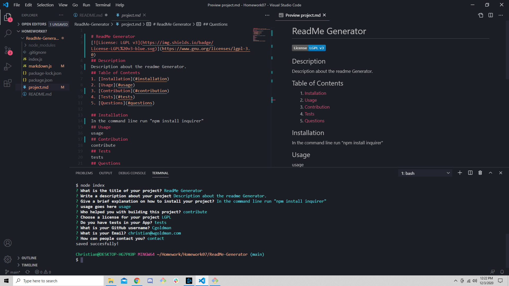

# ReadMe Generator

## Description  
* This project enables a user to quickly build a ReadMe! 
* You can create bullet points in the description section using double pipes! 
* Try it out for youself!
## Table of Contents 
1. [Installation](#installation)
2. [Usage](#usage)
3. [Contribution](#contribution)
4. [Tests](#tests)
5. [Questions](#questions)

## Installation
Clone the repo from github, Navigate to the readme generator folder, in the command line "npm install".  
## Usage   
Once installed a user is able to run the ReadMe generator from the command line! Simply type in "node index.js"! You should see something like this!

## Contribution
Christian Goldman
## Tests 
No
## Questions
https://www.linkedin.com/in/christian-goldman-17330b1b2/  
christian.goldman9638@gmail.com  
[GitHub Username](https://github.com/ChristianGoldman)
## Notice
Copyright 

    Permission is hereby granted, free of charge, to any person obtaining a copy of this software and associated documentation files (the "Software"), to deal in the Software without restriction, including without limitation the rights to use, copy, modify, merge, publish, distribute, sublicense, and/or sell copies of the Software, and to permit persons to whom the Software is furnished to do so, subject to the following conditions:

    The above copyright notice and this permission notice shall be included in all copies or substantial portions of the Software.

    THE SOFTWARE IS PROVIDED "AS IS", WITHOUT WARRANTY OF ANY KIND, EXPRESS OR IMPLIED, INCLUDING BUT NOT LIMITED TO THE WARRANTIES OF MERCHANTABILITY, FITNESS FOR A PARTICULAR PURPOSE AND NONINFRINGEMENT. IN NO EVENT SHALL THE AUTHORS OR COPYRIGHT HOLDERS BE LIABLE FOR ANY CLAIM, DAMAGES OR OTHER LIABILITY, WHETHER IN AN ACTION OF CONTRACT, TORT OR OTHERWISE, ARISING FROM, OUT OF OR IN CONNECTION WITH THE SOFTWARE OR THE USE OR OTHER DEALINGS IN THE SOFTWARE.  